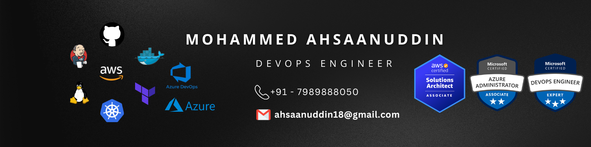

  

# 👋 Hi, I'm Mohammed Ahsaanuddin  

🚀 **Cloud & DevOps Engineer | AWS | Azure | Linux | CI/CD | Kubernetes | Terraform**  

I am a passionate Cloud & DevOps Engineer with hands-on experience in **AWS, Azure, Linux, CI/CD, Docker, Kubernetes, and Infrastructure as Code (Terraform, Ansible)**.  
I love building **scalable cloud infrastructure**, automating deployments, and improving reliability through DevOps best practices.  

---

## 🔧 Skills & Tools  

   
  
   
  
   
  
   
   
   

  

- ☁️ **Cloud**: AWS (EC2, S3, IAM, VPC, RDS, Lambda, CloudWatch), Azure (VMs, VNet, AKS, ACR, Storage, Networking)  
- ⚙️ **DevOps & CI/CD**: Jenkins, GitHub Actions, Azure DevOps, GitLab CI  
- 🐳 **Containers & Orchestration**: Docker, Kubernetes (EKS, AKS)  
- 🛠 **Infrastructure as Code**: Terraform, Ansible, CloudFormation  
- 🔒 **Monitoring & Security**: Prometheus, Grafana, CloudWatch, Trivy  
- 🐧 **Operating Systems**: Linux (Ubuntu, CentOS, Slackware)  
- 💻 **Scripting**: Python, Bash, PowerShell  

---

## 📜 Certifications  

- 🏆 **AWS Certified Solutions Architect – Associate (SAA-C03)**  
- 🏆 **Microsoft Certified: Azure Administrator Associate (AZ-104)**  
- 🏆 **Microsoft Certified: Azure DevOps Engineer Expert (AZ-400)**  

---

## 📈 GitHub Stats  

  
  

---

## 📌 Featured Projects  

- 🔹 [Medusa Backend Deployment on AWS ECS with Terraform](https://github.com/ahsaan-uddin/medusa)  
- 🔹 [Amazon-Prime-Clone](https://github.com/ahsaan-uddin/Amazon-Prime-Clone)  
- 🔹 [Python + Node.js Scraper on AWS](https://github.com/ahsaan-uddin/Node-Python-Web-Scraper)  

*(Check more projects on my [GitHub Repositories](https://github.com/ahsaan-uddin))*  

---

## ✍️ Articles  

I write about **Cloud, DevOps, and Automation** on [Medium](https://medium.com/@ahsaan_devops).  

---

## 📫 Connect with Me  

- 🔗 **GitHub**: [ahsaan-uddin](https://github.com/ahsaan-uddin)  
- 🔗 **LinkedIn**: [Mohammed Ahsaanuddin](https://www.linkedin.com/in/ahsaanuddin/)  
- 📧 **Email**: [ahsaanuddin18@gmail.com](mailto:ahsaanuddin18@gmail.com)  

---

⭐️ *“Automating today for a faster tomorrow.”*  
